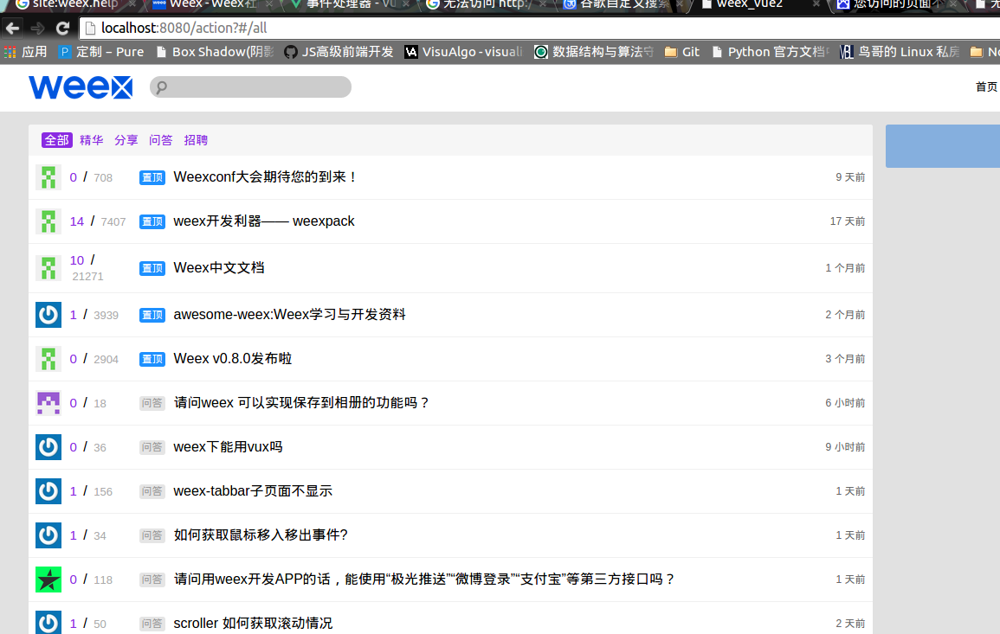

# weex_vue2

> use vue2 and weex api to recreate weex社区

## Build Setup

``` bash
# install dependencies
npm install

# serve with hot reload at localhost:8080
npm run dev

# build for production with minification
npm run build
```

## Question

1. 如何获取 *无人回复的话题* & *积分榜*



